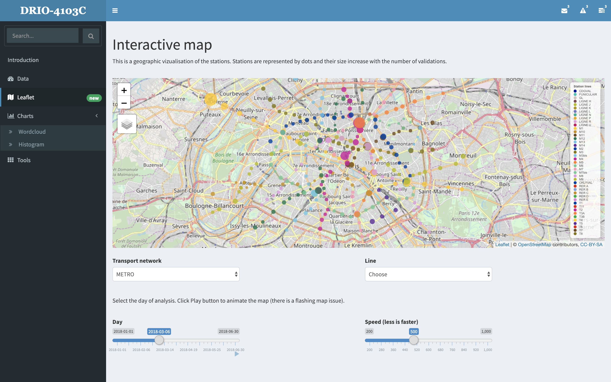
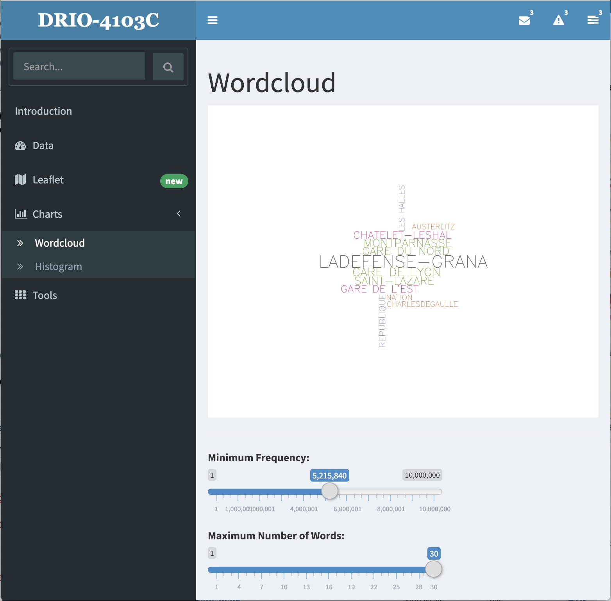

# French public transport visualization in R

Course unit : DRIO-4103C

Developer : Vincent Barbosa Vaz

Teacher : Daniel Courivaud

## App preview

## Case study on public transport in France

This project is based on public transport data in France.
https://opendata.stif.info/explore/?sort=modified

## Data

Datasets are in .csv format, from 300Ko to 40Mo.
We focused on Paris and its periphery.

https://opendata.stif.info/explore/dataset/validations-sur-le-reseau-ferre-nombre-de-validations-par-jour-1er-sem/information/

## Data pre-processing

Pre-processing is done launching the app.

## Packages installation

Project uses external packages.
Their installation is done by script.

## Run

Please define proxy for ESIEE computers, adding these two lines:

Sys.setenv(http_proxy = "http://147.215.1.189:3128")

Sys.setenv(https_proxy = "http://147.215.1.189:3128")

Run init.R firstly ! Attention, it can be long since it downloads all the data from web

Open ui.R in RStudio and click Run App

OR

runApp() in RStudio Console from the right path location